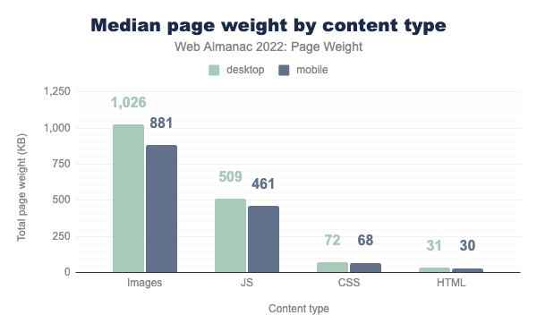
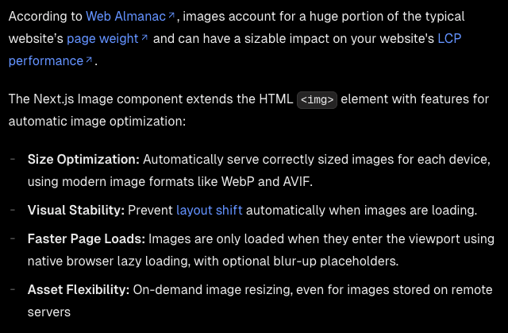
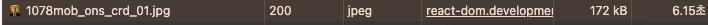
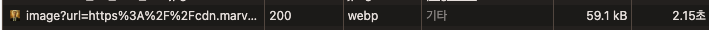
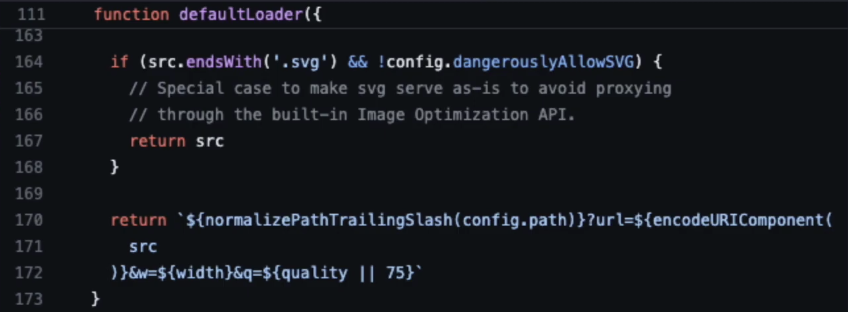
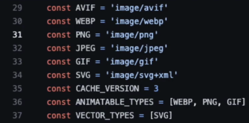
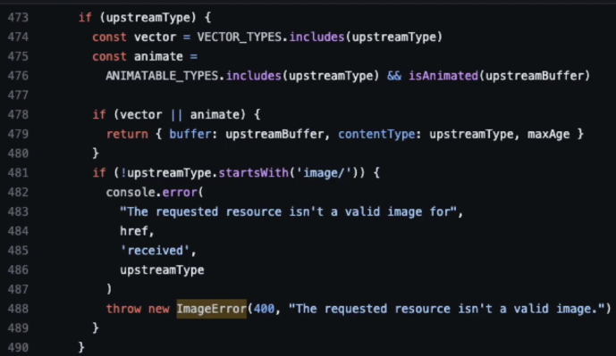
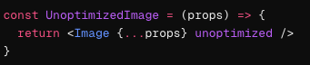

출처: [almanac](https://almanac.httparchive.org/en/2022/page-weight#content-type-and-file-formats)

이미지는 일반적으로 웹페이지 무게의 상당 부분을 차지하며 이는 성능을 저하시키는 요소가 될 수 있습니다.  
웹사이트의 성능을 향상시키기 위해서는 이미지 최적화가 필요합니다.  

해당 내용은 Next.js Image Optimization 공식 문서에 있는 글입니다. Next.js 자체적으로 ``를 확장한 `Image` 컴포넌트를 제공합니다. 이 컴포넌트는 이미지 최적화를 위한 다양한 기능을 제공합니다.  

1. 크기 최적화
   - 각 디바이스에 맞는 크기의 이미지를 자동으로 제공
   - WebP, AVIF 등 최신 이미지 포맷 사용

2. 시각적 안정성
   - 이미지 로딩 시 레이아웃 시프트를 자동으로 방지
     * 레이아웃 시프트(Layout Shift)는 웹 페이지의 콘텐츠가 로딩되는 동안 또는 로딩된 후에 페이지의 레이아웃이 갑자기 변경되는 현상을 말합니다.

3. 페이지 로딩 속도 향상
   - 네이티브 브라우저 지연 로딩을 사용하여 뷰포트에 들어올 때만 이미지 로드
   - 선택적으로 블러 처리된 플레이스홀더 제공 가능

4. 자산 유연성
   - 외부 서버에 저장된 이미지도 포함하여 필요에 따라 이미지 처리 가능

느린 4G 환경에서 일반 `` 태그로 이미지를 로딩했을 때와 next.js의 `Image` 컴포넌트로 로딩했을 때 속도 차이를 직접 비교해봤습니다.

`` 태그

`Image` 컴포넌트

크기와 로딩 시간이 약 3배정도 차이가 나는 것을 확인했습니다.

### 그런데 Image 컴포넌트 src가 조금 다르네요?
`/_next/image?url=https%3A%2F%2F%2Fcdn.marv..&w=820&q=75`

내부적으로 변환 과정이 있습니다.

Next.js는 서버가 실행되면 이미지 최적화를 위한 라우트를 생성합니다. 이 라우트는 `/_next/image`로 시작하며 src에 기입된 경로는 이 라우트를 통해 처리되고, 해당 라우트에서 이미지 최적화 모듈을 사용하여 최적화 작업이 진행됩니다.

Image 컴포넌트의 loader 함수입니다.

외부 이미지 URL의 경우, Next.js는 이를 인코딩하여 `url` 쿼리 파라미터로 전달합니다. 이는 보안상의 이유로 직접적인 외부 URL 사용을 방지하기 위함입니다.

최적화된 이미지는 요청 시 **동적**으로 생성되며, 이후 캐시되어 재사용됩니다. 이를 통해 성능을 향상시키고 서버 부하를 줄일 수 있습니다. (동적으로 생성된 이미지는 [dist]/cache/images 폴더에 저장됩니다.)

뒤에 추가적으로 w와 q값이 전달됩니다.
w는 각 디바이스에 브레이크 포인트에 맞는 이미지 넓이를 계산하는 로직에 필요한 이미지 넓이값, q는 퀄리티 값으로 default는 75입니다.

### 그렇다고 Next.js는 모든 이미지를 최적화 하지는 않는다

SVG같은 벡터 이미지, 상대적으로 복잡하고 최적화에 큰 비용이 드는 GIF나 애니메이션 이미지는 기본적으로 Next.js의 이미지 최적화 과정을 거치지 않습니다.

추가적으로 unoptimized 속성을 사용하여 최적화 제외를 직접 설정할 수 있습니다.

