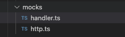

프로젝트 개발은 팀원들 간의 긴밀한 협업을 통해 이루어집니다.
일반적으로 프로젝트는 기획, 디자인, 개발, 테스팅, 배포, 유지보수라는 큰 흐름을 따르며, 각 단계는 더욱 세분화되어 진행됩니다.

프론트엔드 개발자는 사용자 인터페이스(UI)를 구현하고, 백엔드 개발자는 데이터 관리를, 그리고 데브옵스 엔지니어는 배포 인프라 환경을 구축합니다.
각 역할은 서로 밀접하게 연관되어 있어, 원활한 협업이 프로젝트의 성공을 좌우합니다.

프론트엔드 개발자의 주요 업무 중 하나는 백엔드 API를 호출하여 데이터를 화면에 맞게 가공하고 사용자에게 제공하는 것입니다.

그러나 현실은 종종 백엔드 API가 완성되기 전에 프론트엔드 작업을 시작해야 하는 상황에 직면합니다. 프로젝트 데드라인은 다가오고 있는데, 백엔드 팀을 마냥 기다리고 있을 수도 없습니다.

이러한 문제를 해결하기 위해 JSON 더미 데이터 파일을 직접 만들어 임시로 사용하곤 했습니다.
하지만 이 방식은 데이터 구조가 변경될 때마다 파일을 수정해야 하는 번거로움이 있었고, 실제 API가 완성되었을 때 추가적인 통신 레이어 구축이 필요했습니다.

이럴 때 Mocking API를 사용하면 좋습니다. 

백엔드 API가 완성되지 않은 상태에서도 프론트엔드에서 실제 API와 유사한 환경에서 개발 및 테스트를 진행할 수 있습니다.
더불어, 백엔드 API가 완성되면 간단한 환경 변수 조정으로 실제 API로 전환할 수 있어 개발 효율성을 크게 높일 수 있습니다.

이번 포스팅에서는 MSW(Mock Service Worker)를 활용하여 프론트엔드 개발자가 효율적으로 테스트 환경을 구축하는 방법에 대해 상세히 알아보겠습니다.

---

## Next.js 에서 MSW 사용
MSW(Mock Service Worker)의 기본 가이드 문서는 주로 React 클라이언트 사이드 애플리케이션을 기준으로 작성되어 있습니다.  
mockServiceWorker.js 파일을 브라우저에 설치하고, 이를 통해 API 요청을 가로채어 미리 구축해둔 핸들러와 연결된 모의(mock) API로 요청을 리다이렉트합니다.

그러나 Next.js는 서버 사이드 렌더링(SSR)과 클라이언트 사이드 렌더링을 모두 지원하는 하이브리드 프레임워크입니다.  
따라서 MSW를 Next.js에서 효과적으로 사용하기 위해서는 서버와 클라이언트 양쪽 환경에서 모두 작동할 수 있도록 설정해야 합니다.

저는 <strong>Express</strong> 서버와 MSW(Mock Service Worker)의 `http-middleware` 를 통합하여 Mock API 서버를 구축했습니다.  
이 접근 방식은 Next.js의 렌더링 생명주기와 독립적으로 작동하면서, 서버 사이드와 클라이언트 사이드 요청 모두에 대해 일관되고 안정적인 API 모킹을 제공합니다.  
이를 통해 개발 환경에서의 데이터 흐름을 더욱 예측 가능하게 만들고, 프론트엔드와 백엔드의 병렬 개발이 가능합니다.



### http.ts
```typescript
import { createMiddleware } from "@mswjs/http-middleware";
import express from "express";
import cors from "cors";
import { handlers } from "@/mocks/handler";

const app = express();

app.use(
  cors({
    origin: ["http://localhost:3000"],
    optionsSuccessStatus: 200,
    credentials: true,
  })
);
app.use(express.json());
app.use(createMiddleware(...handlers));

app.listen(8080, () => {
  console.log("CREATE MOCK SERVER");
});
```

- app.use()
  - Express의 미들웨어 함수입니다.
  - 애플리케이션의 요청-응답 사이클에 추가적인 기능을 삽입합니다.
- createMiddleware()
  - @mswjs/http-middleware 패키지에서 가져온 함수입니다.
  - MSW의 핸들러들을 Express 미들웨어로 변환합니다.
- ...handlers
  - 스프레드 연산자(...)를 사용하여 handlers 배열의 모든 요소를 개별 인자로 전달합니다.
  - 커스텀화 된 모의 API 응답들의 집합입니다.

### handler.ts
```typescript
import { DUMMY_GAMES, Game } from "@/model/game";
import { http, HttpResponse } from "msw";

export const handlers = [
  http.get("/games", () => {
    return HttpResponse.json(DUMMY_GAMES);
  }),

  http.get("/games/:id", ({ params }) => {
    const { id } = params;
    const game = DUMMY_GAMES.find((game) => game.id === Number(id));
    return HttpResponse.json(game);
  }),

  http.post("/game", async ({ request }) => {
    const body = await request.json();
    const newGame = {
      ...(body as Game),
      id: DUMMY_GAMES.length + 1,
    };
    DUMMY_GAMES.push(newGame);
    return HttpResponse.json(newGame);
  }),
];
```

게임 관련 API의 기본적인 CRUD 작업 중 일부(목록 조회, 단일 항목 조회, 생성)를 모의 구현하였습니다.  
이를 통해 실제 백엔드 API가 준비되지 않은 상태에서도 프론트엔드 개발을 진행할 수 있고, 다양한 시나리오를 테스트할 수 있습니다.

## package.json
```json
"scripts": {
  "dev": "next dev",
  "dev:mock": "concurrently \"npm run dev\" \"npm run mock\"",
  "build": "next build",
  "start": "next start",
  "lint": "next lint",
  "mock": "npx tsx watch ./src/mocks/http.ts"
},
```

mock서버만 돌릴 경우 `npm run mock`  
개발 서버와 mock서버를 동시에 병렬로 돌릴 경우 `npm run dev:mock` 을 실행하면 되겠습니다.