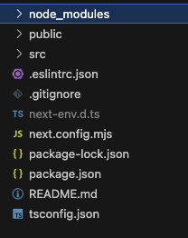
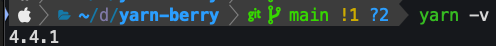
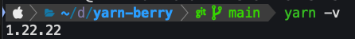
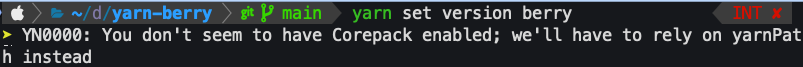
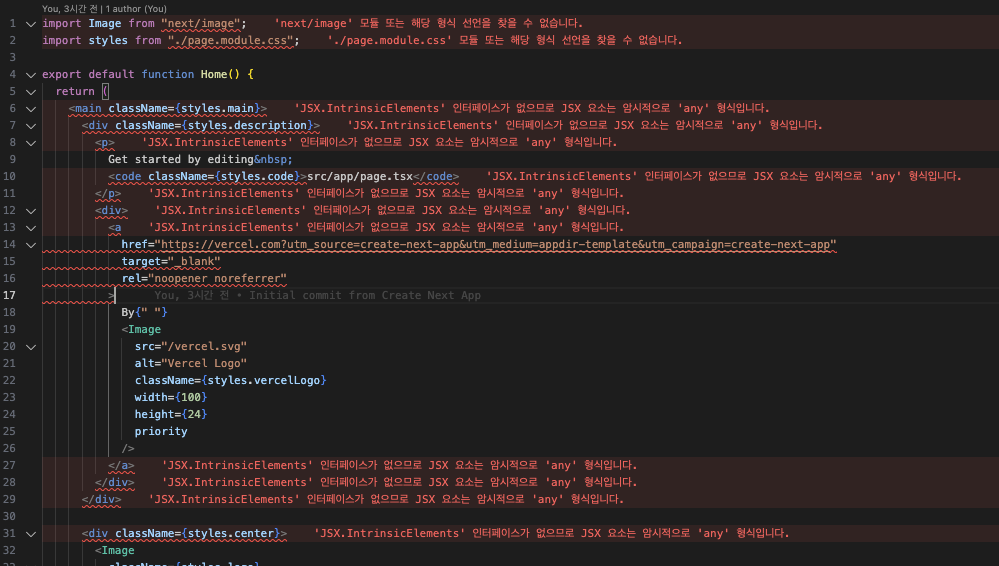

최근 iOS 개발에 몰두해있다가 오랜만에 웹 프론트엔드로 복귀(?) 하니 많은 것들이 바뀐 것 같습니다  
예전엔 npm으로만 패키지 관리를 했었고 막바지에 yarn으로 전환했었는데  
pnpm이라는 것도 나오고 yarn berry라고 일컫는 yarn 버전 2도 나왔다고 합니다.  

웹 프론엔드 생태계가 그렇듯 자고 일어나면 새로운 기술들이 물밀듯이 쏟아져 나오고 급격한 변화가 일어납니다.  
당장 실무 적용은 아니더라도 기술 발전의 흐름을 이해하기 위해서는 트렌드에 뒤쳐지면 안된다고 생각합니다.

요즘 실무에서 많이 사용한다는 yarn berry 개념을 정리해보도록 하겠습니다.  

---

Yarn berry(2+)는 패키지 매니징 과정에서 겪는 많은 문제를 해결해준다고 합니다.  

> 속도  
> Yarn Berry (Yarn 2+)는 Plug'n'Play (PnP) 시스템을 사용하여 의존성을 관리합니다. `.pnp.cjs` 파일에 패키지 위치 정보와 같은 모든 의존성 정보가 포함되어 있어, 패키지 해석 속도가 빨라집니다. 이로 인해 일반적인 의존성 설치 과정보다 더 빠른 성능을 제공합니다.

> 일관성  
> Yarn Berry는 프로젝트에 Yarn 버전 자체를 포함시키므로, 모든 개발자가 동일한 Yarn 버전을 사용하게 됩니다. 이는 패키지 매니저 버전 차이로 인한 lock 파일 불일치 문제를 해결합니다. 또한, PnP 시스템을 통해 모든 개발자가 정확히 동일한 의존성 버전을 사용하게 되어 "works on my machine" 문제를 방지합니다.

> 더 나은 tool  
> Yarn Berry는 확장 가능한 플러그인 아키텍처를 제공합니다. 예를 들어, 환경 변수 플러그인을 사용하여 .env 파일을 자동으로 로드할 수 있어 프로젝트 설정이 간소화되고 환경 변수 관리가 쉬워집니다. 또한, 모노레포(monorepo) 관리를 위한 향상된 워크스페이스 기능을 제공합니다. 특정 워크스페이스만 선택적으로 빌드, 테스트할 수 있고 워크스페이스 간의 의존성도 더 효율적으로 관리할 수 있습니다. 여러 패키지에 걸쳐 동일한 명령을 실행하는 것이 더 쉬워집니다.

## 진행하고 있는 프로젝트 패키지 매니저 확인법
### 프로젝트 루트 디렉토리 확인
- `package.json`:  모든 Node.js 프로젝트에 존재합니다.
- `package-lock.json`:  npm을 사용하는 프로젝트에 존재합니다.
- `yarn.lock`: Yarn을 사용하는 프로젝트에 존재합니다.
- `pnpm-lock.yaml`: pnpm을 사용하는 프로젝트에 존재합니다.
- `.yarnrc.yml`: Yarn Berry (2.x 이상)를 사용하는 프로젝트에 존재합니다.

### package.json 파일 내용 확인
```json
{
  "packageManager": "yarn@3.2.0"
}
```
이와 같은 항목이 있다면 Yarn Berry를 사용하고 있음을 나타냅니다.


### node_modules 폴더 구조
- npm/Yarn 1.x: 일반적인 node_modules 구조
- pnpm: node_modules/.pnpm 폴더가 존재
- Yarn Berry (PnP 모드): node_modules 폴더 대신 .pnp.cjs 파일이 존재

### Yarn Berry 특정 파일
- .yarn 폴더
- .pnp.cjs 또는 .pnp.js 파일  

이러한 방법들을 통해 프로젝트에서 사용 중인 패키지 관리자를 파악할 수 있습니다.

---

직접 실습을 위해 next.js + typescript로 프로젝트에 yarn berry 세팅을 해보겠습니다.
```shell
npx create-next-app@latest --typescript
```
위 명령어로 next.js 기본 세팅을 하면 아래와 같이 프로젝트 구조가 잡히게 됩니다.



`package-lock.json` 파일이 보이고 비대해진 `node_modules` 폴더가 보이는군요  
npm을 사용하고 있습니다.

### Yarn Berry 변경하기

1. 먼저 Yarn을 전역으로 설치합니다<sub>(설치 되어있을 경우 생략)</sub>

```bash
npm install -g yarn
```

2. 프로젝트 디렉토리로 이동합니다

```bash
cd yarn-berry
```

3. Yarn Berry로 초기화합니다

```bash
yarn set version berry
```

프로젝트에서 버전을 확인해보니 stable 버전으로 변경 되었습니다.


Yarn Berry 초기화 전 글로벌로 설치된 yarn은 classic 버전이었구요


:::warning  
그런데 Corepack이 활성화 되어있지 않으면 아래 경고가 뜹니다


Corepack은 Node.js 버전 16.10 이상에서 제공되는 기능으로, 여러 패키지 매니저 버전을 프로젝트 마다 쉽게 관리할 수 있게 해줍니다. 선택사항이나 Corepack도 세팅하도록 하겠습니다.

1. Node.js 버전 확인  
  먼저 Node.js 버전이 16.10 이상인지 확인합니다.
```bash
 node --version
 ```
2. Corepack 활성화  
  Node.js 16.10 이상을 사용 중이라면, 다음 명령어로 Corepack을 활성화할 수 있습니다
```bash
 corepack enable
 ```

3. Yarn 버전 설정  
  Corepack을 활성화한 후, 다시 Yarn 버전을 설정합니다
```bash
yarn set version berry
```
>
4. 버전 확인  
  설정이 제대로 되었는지 확인하기 위해 Yarn 버전을 확인합니다  
```bash
yarn --v
```
프로젝트 내에서 yarn 버전과 프로젝트 외에서 버전이 다르네요. 잘 적용된 것 같습니다.
프로젝트 내에서 사용되는 yarn 버전은 `.yarnrc.yml` 파일에서 확인할 수 있습니다.
```yml
yarnPath: .yarn/releases/yarn-4.4.1.cjs
```
:::
   
4. 이어서 npm의 유산 node_modules 디렉토리와 package-lock.json 파일을 삭제합니다
```bash
rm -rf node_modules
rm package-lock.json
```

5. `.gitignore` 파일에 다음 내용을 추가합니다  

```
.yarn/*
!.yarn/patches
!.yarn/plugins
!.yarn/releases
!.yarn/sdks
!.yarn/versions
.pnp.*
```

6. 의존성을 다시 설치합니다

```bash
yarn
```

7. 프로젝트를 실행해 모든 것이 정상적으로 작동하는지 확인합니다

```bash
yarn dev
```

잘 실행되는군요!

:::CAUTION  
그런데.. 소스코드를 살펴보니



`'JSX.IntrinsicElements' 인터페이스가 없으므로 JSX 요소는 암시적으로 'any' 형식입니다.ts(7026)`  
에러 뿜뿜

yarn berry로 전환하면서 TypeScript 호환 이슈입니다.  
아래 명령어로 TypeScript SDK를 설정하여 해결합니다.
```bash
yarn add -D typescript
yarn dlx @yarnpkg/sdks vscode
```
:::

